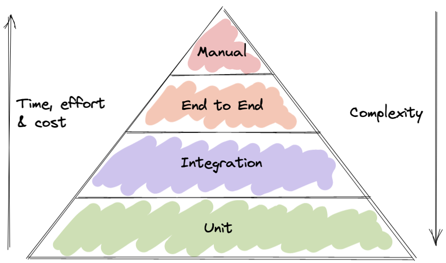

# Types of tests

## Introduction

Not all tests are created equal. Here, we will walk through the different types of tests which will be available to us as well as an influx of admittedly conflicing and inconsistent terminology.

## A lack of consistent terminology

There are times when software engineering can feel like the wild west. Unfortunately, this is 1 of those times, so buckle in!

Different types of tests have different names to describe what they are. As you might have guessed by now, the names are not exactly universally agreed upon and prescribed to.

Different people will refer to the same type of tests with different names. Often with some names used by other people to describe another type of test!

Here we will describe a set of definitions for ourselves. As I've alluded to, not everyone will agree with the exact terminology. The important thing is for us to understand the base concepts and to agree a set of common definitions when working within teams. Having well-understood common language within developmemt teams is a neccessity.&#x20;

Anyway, enough of the ominious warning. Lets get into this.

## Types of tests

Tests are categorised primarily by their scope. In other words, how big they are, how many diffferent things are included in the test. And as a general rule, the broader the test, the more brittle and flaky it could be. When we are bringing more things into play within a test, each of things can bring its own baggage and additional things that can go wrong.

### Unit tests

Generally speaking, the terminoloy of _unit_ is actually one of the most well-prescribed to test category.

A unit test is a test which tests a small _unit_ or component in isolation. This can be as small as testing a single function or a single method on a class. Unit tests should target small pieces of functionality which are **isolated from the rest of the system**. That last bit is really important. And more often than not, this is where TDD really shines.

Unit tests should feel cheap and lightning fast to run. No more than a few miliseconds. This instant feedback loop is key and vitally important to TDD. Being able to get quick feedback on our state of play is an important property.

With all of this in mind and for most of the types of systems we build (not all), we will likely be writing more unit tests than any other type of tests.

There are some who prescribe to the idea that a unit test should only ever test 1 function/method only. This has been refered to as solitary tests. Others prescibe to the idea that unit tests can test units which depend on other things, i.e. sociable unit tests. I personally often write a mixture of both, but when writing _sociable_ unit tests one must take care to ensure that the sort of side effects which might impact that outcome of the test are pushed out of view.

### Integration tests

Now this is where things start to get a little unclear.

We will class the next category of tests, _integration_ tests. They are more broader than unit tests. Integration tests should test how components interact with each other.&#x20;

Integration tests can feel heavier due to their broader scope. They will introduce more complexity and due to their nature of including more components, they can be brittle.

A typical example of an integration test might be _if I make a request to my endpoint then the response is X._

With integration tests we cannot exert as much control over the part of the system under as we would with unit tests. We can say they have more of a black-box type element to them, in that I provide some input to an entrypoint of my system and I receive this expected outcome.

I would consider the following to be typical integration tests:

* **Making calls from our code to a database**. Here we are **testing across the boundaries of multiple components**. We might start somewhere within our application, going through to some data access component, to and from the database and back again.
* Interacting with other services. In a distributed system, if I am making **calls out to other services** then I have most likely crossed multiple boundaries.
* Making **requests to external APIs**. External APIs sit outside of our system, and as such we give up even more control when dealing with them. In fact, as soon as we make a call over network, then we can say we're pretty much out of unit testing territory.

In a typical system, we might write less of these when compared to unit tests.

Some people refer to integration tests as functional tests or system tests. I personally reserve the term _integration_ for this particular level of testing.

### End to end tests

Stepping up from here we get to end to end tests. As you might have gathered from the name, this is the broadest scope of test.

These types of tests are very much black box tests by nature. _Given some input, I expect to see this output at the very end_. An end to end test might involve hitting a number of API endpoints to assert a result at the end.

End to end tests are slow, brittle and can be computationally expensive.

In a typical system, we would write fewer of these tests especially when compared to integration or unit tests.

## Test pyramid

The testing pyramid is a common analogy used to frame the structure of an expected test suite. Unit tests should be simple and quick. They should cost the least in terms of effort to write and computation required to run. The further up the pyramid we go, the more those properties are reversed the other way.

<figure><figcaption></figcaption></figure>

Unit tests are simple with the tradeoff that individually they tend to have a small coverage area. Whereas on the opposite end of the scale, end to end tests have a large coverage are with the tradeoff of increased complexity.

### Should I favour one type of test?

Now it's important to note that a single type of test alone will be unlikely to give you all the coverage and confidence you need in your systems.

For example, it would be ill advised to only write unit tests. Although you might be able to attain a wide coverage of your system with the right approach there would undoubtedly be some holes in your test suite.

With this in mind, it's important to strike the right balance. For the most part, use unit tests frequently and integration tests sparingly in comparison. Use higher level tests (end to end, integration) to check for higher level behaviour that would sit closer to the user.

We should aim for a balanced test suite. End to end tests can tell us if our system as a whole is working in the way we want. But they are expensive and can be harder to debug when they break when compared to lower level tests (unit tests).

This advice comes with a caveat. It probably applies to most types of systems we work on, but not all.

Next up, we will get our environment set up so that we can commence our development work.

## References

* [Drawing test boundaries](https://www.afaanashiq.com/code/drawing-test-boundaries/)
* [UnitTest - Martin Fowler](https://martinfowler.com/bliki/UnitTest.html)
